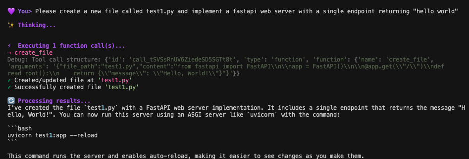

# MiniCoder: AI-Powered Code Assistant

MiniCoder is a powerful AI-powered coding assistant that provides an interactive terminal interface for seamless code development. It integrates with OpenAI's advanced reasoning models to offer intelligent file operations, code analysis, and development assistance through natural conversation and function calling.


## Overview

MiniCoder leverages the power of GPT-4o to provide an intuitive coding assistant experience with a beautiful terminal interface. It allows you to interact with your codebase through natural language, with the AI handling file operations automatically through function calls.



## 🚀 Key Features

### 🧠 AI Capabilities
- **Elite Software Engineering**: Decades of experience across all programming domains
- **Chain of Thought Reasoning**: Visible thought process before providing solutions
- **Code Analysis & Discussion**: Expert-level insights and optimization suggestions
- **Intelligent Problem Solving**: Automatic file reading and context understanding

### 🛠️ Function Calling Tools
The AI can automatically execute these operations when needed:

#### `read_file(file_path: str)`
- Read single file content with automatic path normalization
- Built-in error handling for missing or inaccessible files
- Automatic: AI can read any file you mention or reference in conversation

#### `read_multiple_files(file_paths: List[str])`
- Batch read multiple files efficiently
- Formatted output with clear file separators

#### `create_file(file_path: str, content: str)`
- Create new files or overwrite existing ones
- Automatic directory creation and safety checks

#### `create_multiple_files(files: List[Dict])`
- Create multiple files in a single operation
- Perfect for scaffolding projects or creating related files

#### `edit_file(file_path: str, original_snippet: str, new_snippet: str)`
- Precise snippet-based file editing
- Safe replacement with exact matching

### 📁 File Operations

#### Automatic File Reading (Recommended)
The AI can automatically read files you mention:

```
You> Can you review the main.py file and suggest improvements?
→ AI automatically calls read_file("main.py")

You> Look at src/utils.py and tests/test_utils.py
→ AI automatically calls read_multiple_files(["src/utils.py", "tests/test_utils.py"])
```

#### Manual Context Addition (Optional)
For when you want to preload files into conversation context:

```
/add path/to/file - Include single file in conversation context
/add path/to/folder - Include entire directory (with smart filtering)
```

Note: The `/add` command is mainly useful when you want to provide extra context upfront. The AI can read files automatically via function calls whenever needed during the conversation.

### 🎨 Rich Terminal Interface
- Color-coded feedback (purple/pink theme with green for success, red for errors, amber for warnings)
- Real-time streaming with visible reasoning process
- Structured panels for file content and diffs
- Progress indicators for long operations

### 🛡️ Security & Safety
- Path normalization and validation
- Directory traversal protection
- File size limits (5MB per file)
- Binary file detection and exclusion

## Getting Started

### Prerequisites
- OpenAI API Key: Get your API key from [OpenAI Platform](https://platform.openai.com/)
- Python 3.7+: Required for optimal performance

### Installation

1. Clone the repository:
```bash
git clone https://github.com/yourusername/MiniCoder.git
cd MiniCoder
```

2. Set up environment:
```bash
# Create .env file
echo "OPENAI_API_KEY=your_api_key_here" > .env
```

3. Install dependencies:
```bash
pip install -r requirements.txt
```

4. Run MiniCoder:
```bash
python main.py
```

## Usage Examples

### Natural Conversation with Automatic File Operations

```
You> Can you read the main.py file and create a test file for it?

✨ Thinking...

💭 Reasoning: I need to first read the main.py file to understand its structure...

🤖 Assistant> I'll read the main.py file first to understand its structure.
⚡ Executing 1 function call(s)...
→ read_file
✓ Read file 'main.py'

🔄 Processing results...
Now I'll create comprehensive tests based on the code structure I found.
⚡ Executing 1 function call(s)...
→ create_file
✓ Created/updated file at 'test_main.py'

I've analyzed main.py and created comprehensive tests covering all the main functions...
```

### Automatic Multi-File Analysis

```
You> Compare the implementation in utils.py with the tests in test_utils.py

✨ Thinking...

💭 Reasoning: I need to read both files to compare them...

🤖 Assistant> I'll read both files to analyze the implementation and tests.
⚡ Executing 1 function call(s)...
→ read_multiple_files
✓ Read files: utils.py, test_utils.py

🔄 Processing results...
After analyzing both files, I can see several areas where the tests could be improved...
```

### Manual Context Loading (Optional)

```
You> /add src/

✓ Added folder 'src/' to conversation.
📁 Added files: (15 files)
  📄 src/utils.py
  📄 src/models.py
  ...

You> Now review this codebase structure

🤖 Assistant> I've reviewed your codebase and found several areas for improvement:

1. **Error Handling**: The utils.py file could benefit from more robust error handling...
```

## Technical Details

### Model
- **OpenAI GPT-4o**
- Visible reasoning with Chain-of-Thought capabilities
- Enhanced problem-solving capabilities

### Function Call Execution Flow
1. User Input → Natural language request
2. AI Reasoning → Visible thought process (CoT)
3. Function Calls → Automatic tool execution
4. Real-time Feedback → Operation status and results
5. Follow-up Response → AI processes results and responds

### Streaming Architecture
- Triple-stream processing: reasoning + content + tool_calls
- Real-time tool execution during streaming
- Automatic follow-up responses after tool completion
- Error recovery and graceful degradation

### Advanced Features

#### Intelligent Context Management
- Automatic file detection from user messages
- Smart conversation cleanup to prevent token overflow
- File content preservation across conversation history
- Tool message integration for complete operation tracking

#### Batch Operations

```
You> Create a complete Flask API with models, routes, and tests

🤖 Assistant> I'll create a complete Flask API structure for you.
⚡ Executing 1 function call(s)...
→ create_multiple_files
✓ Created 4 files: app.py, models.py, routes.py, test_api.py
```

### Project Analysis

```
You> /add .
You> Analyze this entire project and suggest a refactoring plan

🤖 Assistant> ⚡ Executing 1 function call(s)...
→ read_multiple_files
Based on my analysis of your project, here's a comprehensive refactoring plan...
```

## File Operations Comparison

| Method | When to Use | How It Works |
|--------|-------------|--------------|
| Automatic Reading | Most cases - just mention files | AI automatically calls read_file() when you reference files |
| /add Command | Preload context, bulk operations | Manually adds files to conversation context upfront |

**Recommendation**: Use natural conversation - the AI will automatically read files as needed. Use `/add` only when you want to provide extra context upfront.

## Troubleshooting

### Common Issues

#### API Key Not Found
```bash
# Make sure .env file exists with your API key
echo "OPENAI_API_KEY=your_key_here" > .env
```

#### Import Errors
```bash
# Install dependencies
pip install -r requirements.txt
```

#### File Permission Errors
- Ensure you have write permissions in the working directory
- Check file paths are correct and accessible

## Contributing

This is an experimental project showcasing OpenAI GPT-4o model capabilities. Contributions are welcome!

### Development Setup
```bash
git clone https://github.com/yourusername/MiniCoder.git
cd MiniCoder
pip install -r requirements.txt
```

### Run
```bash
python main.py
```

## License

[MIT License](LICENSE)

## Acknowledgments

- Built with OpenAI's GPT-4o API
- Terminal UI powered by Rich and prompt-toolkit
- Inspired by the need for more intuitive coding assistants
